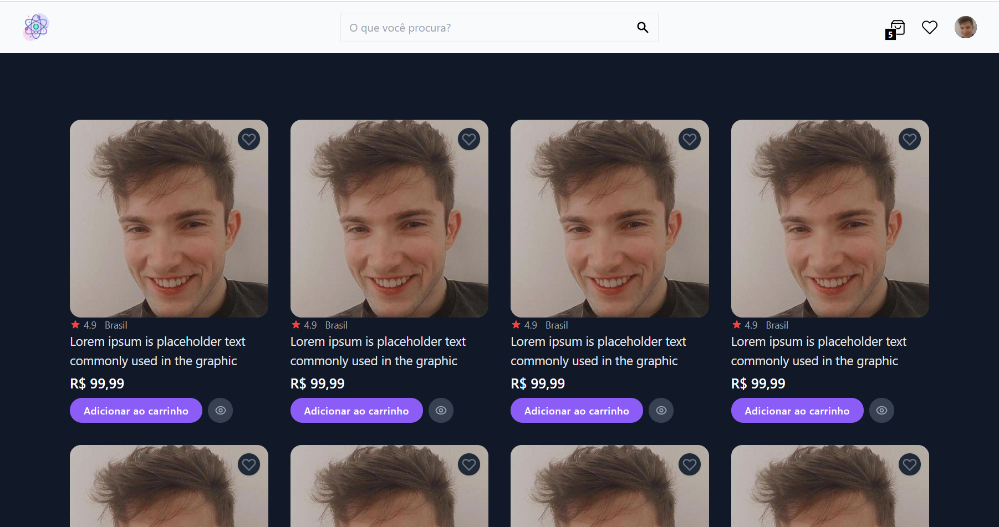
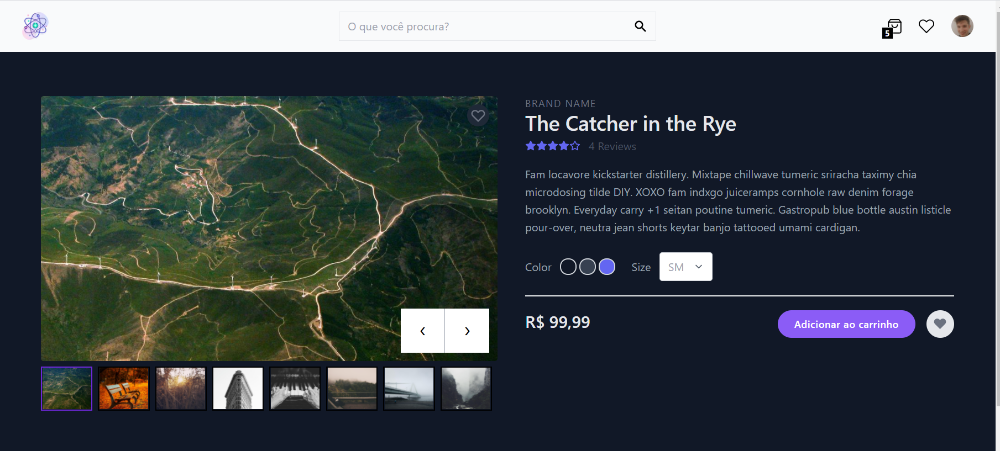

## 👁️‍🗨️ **Preview**

---




---

## 🍄 Sobre

Consiste na implementação básica de um e-Commerce Web

---

## 📝 **Tarefas**

<div align="center">

| Estado | Tarefa                |
| :----: | :-------------------- |
|   ✔️   | Lista de produtos     |
|   ✔️   | Página de produto     |
|   ❌   | Carrinho              |
|   ❌   | Checkout              |
|   ❌   | Confirmação da compra |
|   ❌   | Lista de favoritos    |
|   ❌   | Cadastro              |
|   ❌   | Autenticação          |
|   ❌   | SEO                   |

</div>

---

## 🧪 **Tecnologias**

Esse projeto foi desenvolvido com as seguintes tecnologias:

<div align="center">

|                    🧪 Web                     |
| :-------------------------------------------: |
|         [Nextjs](https://nextjs.org/)         |
| [TypeScript](https://www.typescriptlang.org/) |
|    [Tailwindcss](https://tailwindcss.com/)    |

</div>

---

## 🎮 **Ambiente de desenvolvimento**

```bash
node --version
v16.0.0

yarn --version
1.22.4
```

---

## 🚀 Como executar

-   Clone o repositório
-   Instale as dependências com `yarn`
-   Inicie o servidor com `yarn dev`
-   O app estará disponível no seu browser pelo endereço [`localhost:3000`](http://localhost:3000).

---

## ⚖️ **Licença**

Esse projeto está sob a licença MIT. Veja o arquivo [LICENSE](LICENSE.md) para mais detalhes.

---

Feito com 💜 by Rafael Angonese
